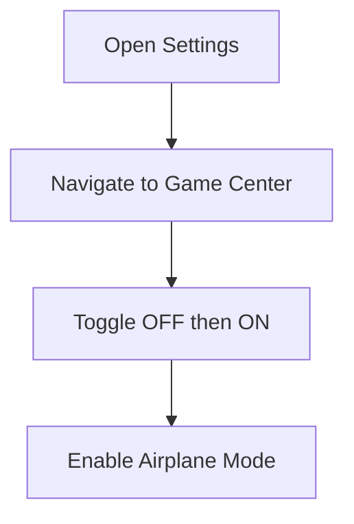

# iCloud FMI OFF Tool - Open Menu  
*Professional Activation Lock Removal Solution*

<p align="center">
  
</p>

## 📌 Core Features
✅ **Open Menu Bypass Technology**  
✅ **Non-Destructive Process**  
✅ **User-Friendly Interface**  
✅ **Step-by-Step Guidance**  
✅ **Device Data Preservation**

<p align="left">
  
</p>

---

## 📱 Device Compatibility
View full compatibility matrix and service tiers:  
🔗 [Official Device List](https://belliactivator.vercel.app)

| Chipset | iOS Version | Model Support     |
|---------|-------------|------------------|
| A9-A11  | 12.0–14.8   | iPhone 6S - X |

---

## 🛠️ Complete Workflow Guide

### Prerequisites
- Windows 10/11 PC
- Original USB cable
- 3uTools installed
- Stable internet connection

### Step-by-Step Process

1. **Initialization**
   - Launch the tool and connect your device via USB.
   - Click the "Start" button.

2. **Device Preparation**



3. **Execution Phase**
   - Wait for the "Success" message (approx. 2–5 minutes).
   - Immediately perform a **Full Flash** via 3uTools.  
     ⚠️ *Make sure to disable Airplane Mode before flashing!*

4. **Completion**
   - Install a fresh version of iOS.
   - Set up as a new device.

---

## 🖥️ Tool Interface Preview
<p align="center">
  
  <br>
  <em>Real-time status monitoring interface</em>
</p>

---

## 📞 Support Channels
**Premium Support Available**  
- Telegram: [@ZP_H3](https://t.me/ZP_H3) (24/7)  
- Email: bellidevsupport@chefalicious.com 
- Discord: [BelliDev Community](https://belliactivator.vercel.app)  
- Instagram: [_3e11i](https://instagram.com/_3e11i)

*Average response time: <15 minutes*

---

## 👨‍💻 Development Team
<p align="center">
  
  <br>
  <strong>Hamza – Lead Developer</strong><br>
  <sub>iOS Security Researcher since 2018</sub>
</p>

---

## 🌍 Social Presence
| Platform | Link | Content |
|----------|------|---------|
| YouTube | [@BELLIDEV](https://youtube.com/@BELLIDEV) | Tutorials & Updates |
| Twitter | [@n1g4tt4](https://x.com/n1g4tt4) | Security Alerts |
| GitHub | [BelliDev](https://github.com/b9yn8) | Open-Source Tools |
| Instagram | [_3e11i](https://instagram.com/_3e11i) | Behind-the-Scenes |

---

## ⚠️ Comprehensive Legal Disclaimer

### Intended Use
This tool is strictly intended for:
- Legal device owners
- Educational research
- Account recovery
- Digital forensics

### Compliance & Legal Framework
1. **DMCA Compliance**  
   Jailbreaking is explicitly permitted under 17 U.S.C. § 1201(f) for interoperability and security research.

2. **Fair Use Statement**  
   Copyrighted materials are used under 17 U.S.C. § 107 for:
   - Security research
   - Education
   - Technical illustration

3. **Prohibited Uses**  
   ❌ Commercial bypass services  
   ❌ Stolen device activation  
   ❌ Circumvention for resale

4. **Liability Waiver**  
   By using this tool, you confirm that:
   - You are the legal device owner
   - All actions follow your local laws
   - You accept full responsibility

---

## 📜 YouTube Disclaimer

**Disclaimer:**  
The information available on this YouTube channel is for educational and informational purposes only. This channel does not provide advice for any loss or damage, and all actions are performed at your own risk. The contents are shared strictly for educational use under fair use laws.

We do not promote or support theft or illegal business purposes. This method is solely intended for individuals who forgot their iCloud password or no longer have access to their recovery options.

**Jailbreaking & Rooting are 100% legal** under the Digital Millennium Copyright Act (DMCA).

**Copyright Disclaimer (Section 107):**
Allowance is made for "fair use" for purposes such as criticism, comment, news reporting, teaching, scholarship, and research. Educational or personal use tips the balance in favor of fair use.

---

## 📥 Download Options
1. **Markdown Version**: [Download README.md](javascript:void(0);) *(Right-click → Save As)*  
2. **PDF Version**: [Download Documentation.pdf](javascript:void(0);)  
3. **Website Mirror**: [Full Documentation](https://belliactivator.vercel.app/#)

```html
<!-- HTML Embed Code -->
<a href="https://belliactivator.vercel.app" download="iCloud_FMI_Guide.html">
  Download Complete Guide
</a>
```

*Note: Replace javascript:void(0) with real links when hosted*

---

**For enterprise licensing or security researcher inquiries:**  
📧 contact@bellidev.tech  
🔐 PGP Key: [Available on Keybase](https://keybase.io/)

*Last Updated: 2025-05-04*
